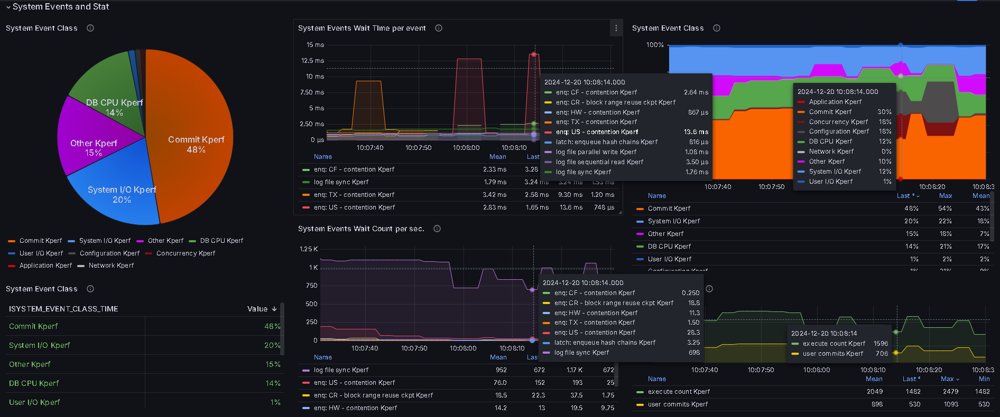
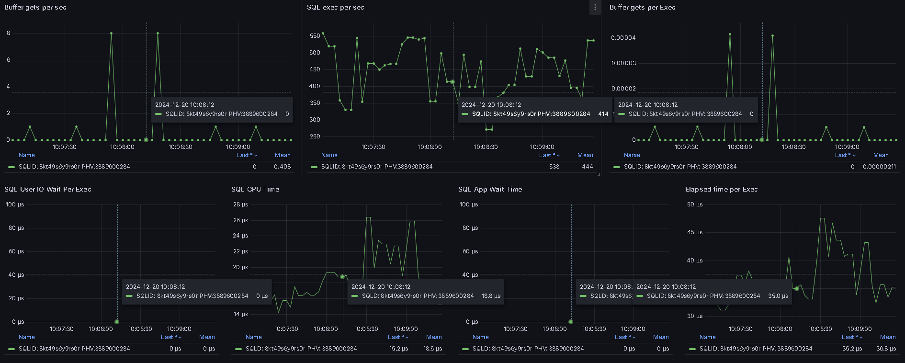

# kPerf For Oracle 2.5.1

kPerf provides a graphical view of activity in Oracle Database.
In the current implementation, statistics are collected at **the instance level** and **session level**, including waits, statistics for sqlid:phv and sessions.
kPerf is free to use but protected by Pyarmor with an integrated license, check the [Info](#Info).
The license will be updated in the next release.
kPerf is designed for monitoring Oracle in a specific way, focusing on performance rather than just sending warning emails. 

- [Short Demo](https://youtu.be/gw2DuXm1W5Y) 
- In version 2.5.1, SQLTEXT was added, along with the ability to connect to the database using a TNS alias.

1. Module: InstanceWaitStat&SQL: 

2. Module: SQL details

3. Module: SESSION

4. Module: DBSIZE

---

## Table of Contents
1. [Features](#features)
2. [Usage](#usage)
3. [Permissions](#permissions)
4. [Installation](#installation)
5. [Support Oracle Database Version](#support-oracle-database-version)
6. [BUG](#BUG)
7. [Info](#Info)
8. [Contact](#contact)

***

## Features

- kPerf for Oracle does not require creating any objects inside the Oracle database or access to ASH.
- kPerf for Oracle does not require the Diagnostic or Tuning pack to collect metrics from the Oracle database.
- You only need to create a user in the database and grant the necessary privileges.
- The password for the user will be encrypted and stored in the config file.
- kPerf operates in a true PULL mode to improve precision.
What does this mean? It means that all metrics for all modules begin to be collected only when someone performs a GET request.
- Metrics have several labels (dimensions), and you can join them with other metric and filter them.

All collected data is processed in kPerf(Python).
The collected data is stored in Prometheus.
Grafana is used for data visualization (dashboards are included).
Currently, data is collected from:
 -  v_$system_event 
 -  v_$sysstat
 -  v_$sqlarea
 -  v_$sys_time_model
 -  v_$sess_time_model
 -  v_$session
 -  v_$sqlcommand
 -  v_$session_event
 -  v_$sesstat
 -  dba_segments 
 -  dba_data_files
 -  cdb_data_files

## Usage
- Database Performance Monitoring: The system allows real-time analysis of database activity, identifying bottlenecks and problematic queries.
- Performance Issue Diagnosis: Use data on wait events, system statistics, and SQL execution to detect and resolve performance issues.
- Long-term Trend Analysis: Store historical data in Prometheus to identify patterns in database resource usage.
- Integration with Existing Monitoring Systems: Visualization via Grafana can be seamlessly integrated into existing infrastructure.

Real-World Use Cases of kPerf:
- [The impact of a commit on task execution time.](https://krotovks.com/2024/05/19/oracle-the-impact-of-a-commit-on-task-execution-time/)
- [Unexplained growth a table size. Oracle 19.19, bug 30265523.](https://krotovks.com/2024/05/04/unexplained-growth-a-table-size-oracle-19-19-bug-30265523/)
- [Log file sync switching to post/wait.](https://krotovks.com/2023/02/21/log-file-sync-switching-to-post-wait-eng/)

***
## Module: InstanceWaitStat&SQL

-  
-  

| Metric Name		                    | Labels                 | Description                                                                   | Comment                               |  
|----------------------------------|------------------------|-------------------------------------------------------------------------------|---------------------------------------|
| SYSTEM_EVENTS_CLASS_TIME         | CLASS,KJOB             | Delta V_\$SYSTEM_EVENT Time group by Class and DB CPU from V_\$SYS_TIME_MODEL |		 
| SYSTEM_EVENTS_CLASS_WAITS        | CLASS,KJOB 	          | Delta V_\$SYSTEM_EVENT Time group by Class and DB CPU from V_\$SYS_TIME_MODEL |
| SYSSTAT	                        | NAME,KJOB              | Delta V_$SYSSTAT where STATISTIC# not in (0, 1, 1728) and CLASS not in (32)   | Almost all statistics from V_$sysstat |
| SYSTEM_EVENT_WAIT_COUNT          | SYSTEM_EVENT,CLASS,KJOB | Delta SYSTEM_EVENT Wait Count                                                 | All from V_$system_event	             |
| SYSTEM_EVENT_WAIT_TIME           | SYSTEM_EVENT,CLASS,KJOB | 	Delta SYSTEM_EVENT Wait TIME microsec                                        | All from V_$system_event	             |
| SYSTEM_EVENT_WAIT_COUNT_PER_SEC  | SYSTEM_EVENT,CLASS,KJOB | SYSTEM_EVENT Wait per sec |                                       |	
| SYSTEM_EVENT_WAIT_TIME_PER_EVENT | SYSTEM_EVENT,CLASS,KJOB | SYSTEM_EVENT Time per Event in microsec | |
-  **You can filter and join metrics by variety of labels.**

## Module: SQL details
-  
-  SQLID is clickable. SQLID format is "ConID-SQL_ID", e.g. 1-1ggnc49rkynr4: Container ID-1, SQL_ID- 1ggnc49rkynr4
-  

| Metric Name		          | Labels                  | Description                                                                       | Comment                                     |  
|------------------------|-------------------------|-----------------------------------------------------------------------------------|---------------------------------------------|
| SQL_ELA_PER_EXEC       | SQLID,PHV,SQLTEXT,KJOB | Elapsed time per execution (μs) for SQL ID and specific plan hash value.          |                                             |
| SQL_CPU_TIME_PER_EXEC  | SQLID,PHV,SQLTEXT,KJOB | CPU Time per execution (μs) for SQL ID and specific plan hash value.              | on CPU	                                     |
| SQL_APPWAIT_PER_EXEC	  | SQLID,PHV,SQLTEXT,KJOB | AppWait wait time per execution (μs) for SQL ID and specific plan hash value.     | v$event_name where WAIT_CLASS='Application' |
| SQL_CONCUR_PER_EXEC    | SQLID,PHV,SQLTEXT,KJOB | Concurrency wait time per execution (μs) for SQL ID and specific plan hash value. | v$event_name where WAIT_CLASS='Concurrency' |
| SQL_IO_TIME_PER_EXEC   | SQLID,PHV,SQLTEXT,KJOB | User IO Wait Time per execution (μs) for SQL ID and specific plan hash value.     | v$event_name where WAIT_CLASS='User I/O'    |
| SQL_EXECUTIONS_PER_SEC | SQLID,PHV,SQLTEXT,KJOB | SQL executions per SECOND for SQL ID and plan hash value                          |                                             |
| SQL_BG_PER_SEC         | SQLID,PHV,SQLTEXT,KJOB | Buffer gets per SECOND for SQL ID and specific plan hash value                    | 	                                           |
| SQL_BG_PER_EXEC        | SQLID,PHV,SQLTEXT,KJOB | Buffer gets per SQL EXECUTION for SQL ID and specific plan hash value             | 	                                           |
| SQL_ELAPSED_TIME       | SQLID,PHV,SQLTEXT,KJOB | Delta Elapsed time in microseconds                                                |                                             |
| SQL_CPU_TIME           | SQLID,PHV,SQLTEXT,KJOB | Delta CPU time in microseconds                                                    |                                             |
| SQL_APPWAIT_TIME       | SQLID,PHV,SQLTEXT,KJOB | Delta AppWait in microseconds                                                     |                                             |
| SQL_CONCURRENCY_TIME   | SQLID,PHV,SQLTEXT,KJOB | Delta CONCURRENTCY time in microseconds                                           |                                             |
| SQL_USERIOWAIT         | SQLID,PHV,SQLTEXT,KJOB | Delta UserIOwait time in microseconds                                             | 	                                           |
| SQL_EXECUTIONS         | SQLID,PHV,SQLTEXT,KJOB | Delta SQL EXECUTIONS                                                              |                                             |
| SQL_BG                 | SQLID,PHV,SQLTEXT,KJOB | Delta Buffer gets |                                             | |

-  **You can filter and join metrics by variety of labels.**
***

## Module: SESSION

-  
-  SID format is "ConID-SID-Serial", e.g. 2-45-3355 is Container ID-2, SID-45, Serial-3355

| Metric Name		             | Labels                                                                                       | Description                                        | Comment |  
|---------------------------|----------------------------------------------------------------------------------------------|----------------------------------------------------|---------------|
| ACTIVE_SESSION_STATUS     | SID, USERNAME, WAITCLASS, SQLTEXT, KJOB	                                                     | Active Session State                               |                              |
| SESSION_DELTA_EVENTS_TIME | SID, USERNAME, PROGRAM, SQLTEXT, COMMAND_NAME, MACHINE, SQLID, STATE, WAITCLASS, EVENT, KJOB | Delta of time waited (in milliseconds) the session |                                |
| SESSION_DELTA_WAIT_EVENTS | SID, USERNAME, PROGRAM, SQLTEXT, COMMAND_NAME, MACHINE, SQLID, STATE, WAITCLASS, EVENT, KJOB | Delta of Wait Events                               | 

***

## Module: DBSIZE
-  You can filter Object Size by five parameters: labelnames=['TABLESPACE','OWNER','SEGMENT_NAME','SEGMENT_TYPE','PARTITION_NAME']
-  for Multitenant labelnames=['CONID','TABLESPACE','OWNER','SEGMENT_NAME','SEGMENT_TYPE','PARTITION_NAME']
- 
- 

| Metric Name		  | Labels                                                               | Description | Comment |  
| ------------------- |----------------------------------------------------------------------| ------------|---------------|
| DB_OBJECT_SIZE | CONID, TABLESPACE, OWNER, SEGMENT_NAME, SEGMENT_TYPE, PARTITION_NAME |	Database objects size in bytes | |
| DB_DATAFILE_SIZE | CONID, TABLESPACE, FILE_ID , STATUS                                  | Database Data File size in byte | |
-  **You can filter and join metrics by variety of labels.**
---------------------------------------------------------------------------------

Additional features will be available in the next release.

and there's more to come.

# Installation

## Database Permissions

 - select on v_$system_event 
 - select on v_$sysstat
 - select on v_$sqlarea
 - select on v_$sys_time_model
 - select on v_$sess_time_model
 - select on v_$session
 - select on v_$sqlcommand
 - select on v_$session_event
 - select on v_$sesstat
 - select on dba_segments 
 - select on dba_data_files
 - select on cdb_data_files

## Requirements

  - **Python = 3.11**
  - target platforms: linux.x86_64
  - Grafana Version: **grafana-12.3.1-1**
  - kPerf_Standalone/requirements.txt

## Config File Options
- Add TNS aliases to the tnsnames.ora file in the kPerf_Standalone folder.
- File: kPerfENV.cfg

| Parameter Name	      | Description 		  				   	   									                                                                     | Default Value | Possible Value	        |
|----------------------|----------------------------------------------------------------------------------------------------------|---------------|------------------------|
| ISDATABASECDB		      | Is Oracle Database a CDB or a Non-CDB? 	   									                                                     | False		       | 	False/True	str	       |
| DBSIZEINTERVAL	      | Collection interval in seconds for the DBSIZE module.					                                               | 3600			         | 	from 1 to ANY int     |
| DBSIZEMINOBJSIZE	    | Minimum object size for data collection (in bytes).							                                               | 2621441			     | 	from 1 to ANY int     |
| HTTPPORT			          | http port for web-server (SQL and Wait metrics collection. InstanceWaitStat&SQL MODULE)												      | 9180			       | from 1024 to 60000 int |
| HTTPPORTSESS | http port for web-server (SESSION MODULE)                                                                |  9281  |      from 1024 to 60000 int |
 | HTTPPORTDBSIZE | http port for web-server (DBSIZE MODULE)                                                                 |  9382  |      from 1024 to 60000 int |
| SESPROMSCRAPINTERVAL | The interval in seconds is configured in Prometheus(scrape_interval) ***JUST FOR CALCULATION in kPerf*** | 3				         | 	from 1 to ANY int	    |
| IPADDR			            | On which IP address is the web server listening on HTTPPORT?				                                         | 0.0.0.0		     | 	Valid ip v4 str		     |
| ISSQLMODULE		        | Enable or Disable SQL and Wait metrics collection. SQL MODULE.				                                       | True			       | 	False/True	str		      |
| ISDBSIZE			          | Enable or disable DB object size collection. DBSIZE MODULE.			                                           | True			       | 	False/True	str		      |
| ORACLE_USER		        | Oracle Database user.														                                                                      | 	N/A			       | Valid user name str    |
| ORACLE_PASSWORD	     | Oracle user's password. 														                                                                   | N/A			        | Valid password str     |
| DEBUGON			           | Spool additional info to the logfile.										                                                          | False		       | 	False/True	str        |
| JOBMARKER						      | Global Uniq Job name for kPerf Instance Mertrics.	                                                       | kjob1	        | str                    |                                                  

***When available, you must set the variables “Min Step” and “Snap Interval” equal to Prometheus (scrape_interval), which is used in the specific module, to ensure precise calculations on the dashboard.***

### Installation Steps

1. Clone the repository:
   git clone https://github.com/krotovks/kPerf_for_Oracle.git
	
	#### kPerf_Standalone
	 The standalone version consists of kPerf and a Grafana dashboard located in the 'Boards' folder.
		
		cd kPerf_Standalone
		pip3.11 install -r requirements.txt
		Create a user in the Oracle database using either createSQLuser_for_Multitenant.sql or createSQLuser_NonCDB.sql.
		***For a multi-tenant database, you must create the user in the ROOT container using createSQLuser_for_Multitenant.sql.***
		The kPerfENV.cfg file contains the startup parameters(Section: Config File Options).
        Add TNS aliases to the tnsnames.ora file in the kPerf_Standalone folder.
				
        - To start kPerf.py, ensure you are in the kPerf_Standalone directory; otherwise, the kPerfENV.cfg file will not be read.
        - You should not modify the structure of kPerf_Standalone, but you are allowed to rename it.
		Example of execution:
		python3.11 ./kPerf.py
	To use link and logic in Dashboards use configure job names in Prometeus as:
	1. - For Module: InstanceWaitStat&SQL(parameter HTTPPORT):  %Kperf-Monitor%
    2. - For Module: SESSION (parameter HTTPPORTSESS): %Kperf-Session%
    3. - For Module: DBSIZE (parameter HTTPPORTDBSIZE) %Kperf-DBSIZE%
	4. - Next, configure your Prometheus using the PORTs parameters from kPerfENV.cfg accordingly. 
    Remember, the trigger for collecting and calculating metrics is the scrape_interval in your prometheus.yml, another word as often as the scrape_interval value.
 ## Support Oracle Database Version
 - Oracle 23ai
 - Oracle 19c
 - Oracle 12c

 ## BUG
 - Lack of documentation. The documentation is under development and will be released soon.

 ## Info
 - Current Version 2.5.1. 
 - License has been extended until 2026-12-01 (yyyy.mm.dd).

## Contact
 If you have any questions, feel free to contact me via: 
- 📧 Email: krotovks [at] gmail [dot] com
- 💬 Telegram: [@krotovks](https://t.me/username)
- 🔗 LinkedIn: [Krotov Konstantin](https://www.linkedin.com/in/krotovks/)
- :link: Blog: [My Blog](https://krotovks.com)  