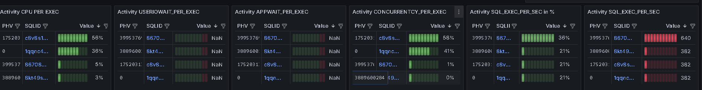

# :fire: kPerf For Oracle :fire:

kPerf provides a graphical view of activity in Oracle Database.
In the current implementation, statistics are collected at the instance level, including waits and some key statistics for sqlid:phv.
kPerf is free to use but protected by Pyarmor with an integrated license that expires on 2025-08-01 yyyy.mm.dd.
The license will be updated in the next release.
kPerf is designed for monitoring Oracle in a specific way, focusing on performance rather than just sending warning emails. 
1. Module: SQL and Wait Events: 

2. Module: DBSIZE

## Table of Contents
1. [Features](#features)
2. [Usage](#usage)
3. [Permissions](#permissions)
4. [Installation](#installation)
5. [Support Oracle Database Version](#support-oracle-database-version)
5. [Contact](#contact)

## Features

It is not required to create any objects inside the Oracle database.
You only need to create a user in the database and grant the necessary privileges.
All collected data is processed in kPerf(Python).
The collected data is stored in Prometheus.
Grafana is used for data visualization (dashboards are included).
Currently, data is collected from:
 -  v_$system_event 
 -  v_$sysstat
 -  v_$sqlarea
 -  v_$sys_time_model
 -  dba_segments 
 -  dba_data_files
 -  cdb_data_files

---------------------------------------------------------------------------------
-  :white_check_mark: Instance-Level Metrics Description:
-  :warning: labelnames will be unified in the next release.
-  
-  

| Metric Name		  | Description | Comment |  
| ------------------- | ----------------------|---------------|
| SYSTEM_EVENT_CLASS  | SUM(TOTAL_WAITS) group by WAIT_CLASS from V_$SYSTEM_EVENT |		 
| SYSTEM_EVENT_CLASS_TIME  		  | SUM(TIME_WAITED_MICRO) group by WAIT_CLASS from V_$SYSTEM_EVENT and V_$SYS_TIME_MODEL |
| SYSSTAT			  | from V_$sysstat where s.STATISTIC# not in (0, 1, 1728) and s.CLASS not in (32) | Almost all statistics from V_$sysstat |
| SYSTEM_EVENT_WAIT_COUNT | Wait Event Count per Event from V_$system_event | All from V_$system_event	|
| SYSTEM_EVENT_WAIT_TIME  |	Wait Event Time per Event from V_$system_event  | All from V_$system_event	|

---------------------------------------------------------------------------------
- :white_check_mark: SQL-Level Metrics Description:
-  You can filter SQL statements by SQLID and Plan Hash Value. labelnames=['SQLID','PHV']
-  
-  SQLID is clickable.
-  

| Metric Name		  | Description | Comment |  
| ------------------- | ----------------------|---------------|
|ELA_PER_EXEC		  |Elapsed time per execution (μs) for SQL ID and specific plan hash value. |  |
|CPU_PER_EXEC | CPU Time per execution (μs) for SQL ID and specific plan hash value. | on CPU	|
|APPWAIT_PER_EXEC	| APPLICATION_WAIT_TIME per execution (μs) for SQL ID and specific plan hash value.| v$event_name where WAIT_CLASS='Application' |
|CONCURRENTCY_PER_EXEC | CONCURRENCY_WAIT_TIME per execution (μs) for SQL ID and specific plan hash value.| v$event_name where WAIT_CLASS='Concurrency' |
|USERIOWAIT_PER_EXEC | USER_IO_WAIT_TIME per execution (μs) for SQL ID and specific plan hash value.| v$event_name where WAIT_CLASS='User I/O' |
|SQL_EXECUTIONS_PER_SEC | SQL executions per SECOND for SQL ID and plan hash value | |
|SQL_BG_PER_SEC	| Buffer gets per SECOND for SQL ID and specific plan hash value |	|
|SQL_BG_PER_EXEC | Buffer gets per SQL EXECUTION for SQL ID and specific plan hash value |	|

---------------------------------------------------------------------------------

- :white_check_mark: DB Size Metrics Description:
-  You can filter Object Size by five parameters: labelnames=['TABLESPACE','OWNER','SEGMENT_NAME','SEGMENT_TYPE','PARTITION_NAME']
-  for Multitenant labelnames=['CONID','TABLESPACE','OWNER','SEGMENT_NAME','SEGMENT_TYPE','PARTITION_NAME']
- 
- 

| Metric Name		  | Description | Comment |  
| ------------------- | ------------|---------------|
| DB_OBJECT_SIZE |	Database objects size in bytes | |
| DB_DATAFILE_SIZE | Database Data File size in byte | |

---------------------------------------------------------------------------------

:fire: Additional features will be available in the next release. :fire:

## Usage
	
1. kperf_Docker_Image - An autonomous image that includes kPerf, Prometheus, and Grafana.
The image is fully configured; you only need to run it by specifying your parameters (more details in the "Installation" section).
   
2. kPerf_Standalone - For standalone use. kPerf and Grafana dashboards are included (more details in the "Installation" section).

Both options can be used in the cases listed below and beyond:

- Database Performance Monitoring: The system allows real-time analysis of database activity, identifying bottlenecks and problematic queries.
- Performance Issue Diagnosis: Use data on wait events, system statistics, and SQL execution to detect and resolve performance issues.
- Long-term Trend Analysis: Store historical data in Prometheus to identify patterns in database resource usage.
- Integration with Existing Monitoring Systems: Visualization via Grafana can be seamlessly integrated into existing infrastructure.
	
Real-World Use Cases of kPerf:
- [The impact of a commit on task execution time.](https://krotovks.com/2024/05/19/oracle-the-impact-of-a-commit-on-task-execution-time/)
- [Unexplained growth a table size. Oracle 19.19, bug 30265523.](https://krotovks.com/2024/05/04/unexplained-growth-a-table-size-oracle-19-19-bug-30265523/)
- [Log file sync switching to post/wait.](https://krotovks.com/2023/02/21/log-file-sync-switching-to-post-wait-eng/)

and there's more to come.

	

## Permissions
 - select on  v_$system_event 
 - select on  v_$sysstat
 - select on  v_$sqlarea
 - select on  v_$sys_time_model
 - select on  dba_segments 
 - select on  dba_data_files
 - select on  cdb_data_files

## Installation

### Requirements

  - Python >= 3.9
  - target platforms: linux.x86_64
  - git-lfs
  - git
  - Docker (Optional)

### Config File Options
- File: kPerfENV_Docker 
- File: kPerfENV

| Parameter Name	  | Description 		  				   	   									| Default Value |  Possible Value	  |
| ------------------- | -------------------------------------------									|---------------|----------------------|
| ISDATABASECDB		  | Is Oracle Database a CDB or a Non-CDB? 	   									| False		    |	False/True	str	  |
| DBSIZEINTERVAL	  | Collection interval is in seconds for the DBSIZE module.					| 30			| 	from 1 to ANY int |
| DBSIZEMINOBJSIZE	  | Minimum object size for data collection (in bytes).							| 65536			|	from 1 to ANY int |
| HTTPPORT			  | Hppt port for web-server													| 9180			|   from 1024 to 60000 int|
| SNAPINTERVAL		  | Interval in sec between data collection snapshots for SQL and Wait metrics	| 2				|	from 1 to ANY int	  |
| IPADDR			  | On which IP address is the web server listening on HTTPPORT?				| 0.0.0.0		| 	Valid ip v4 str		  |
| ISSQLMODULE		  | Enable or Disable SQL and Wait metrics collecting. SQL MODULE				| True			| 	False/True	str		|
| ISDBSIZE			  | Enable or Disable SQL and Wait metrics collecting. DBSIZE MODULE			| True			|	False/True	str		|
| ORACLE_USER		  | Oracle Database user														|	N/A			|   Valid user name str|
| ORACLE_PASSWORD	  | Oracle user's password 														|   N/A			| Valid password str|
| ORACLE_HOST		  | Ip addres or DNS of Oracle Database Server									|   N/A			| Ip addres or DNS str |
| ORACLE_PORT		  | Oracle Listener Port														|   1521		| Valid port number str |
| ORACLE_SERVICE_NAME | Oracle Service Name															|	N/A			| Valid Service Name str|
| DEBUGON			  | Spool additional info to the logfile										|   False		|	False/True	str |

### Installation Steps

0. Install git-lfs to download the Docker image.
1. Clone the repository:
   git clone https://github.com/krotovks/kPerf_for_Oracle.git
   	
	#### ALL-In-One kperf_Docker_Image
		cd kperf_Docker_Image
		podman load -i kperf.2.1.0.tar
		Create a user in the Oracle database using either createSQLuser_for_Multitenant.sql or createSQLuser_NonCDB.sql.
		The file kPerfENV_Docker contains the parameters(Section: Config File Options) for running the container.
		
		Example of execution:
		podman run -it --env-file kPerfENV_Docker -p 3000:3000 -p 9180:9180 -p 9090:9090 kperf:2.1.0
	- In case you have some problem with the container, you can check the log in the directory /var/log/supervisor inside the container.

	- Grafana URL:    http://Docker_IP:3000  User:admin passwd: admin
	- kPerf URL:   	http://Docker_IP:9180
	- Prometheus URL: http://Docker_IP:9090/targets?search=
	- Inside the container, logs are available in /var/log/supervisor.
	
	#### kPerf_Standalone
	 The standalone version consists of kPerf and a Grafana dashboard located in the 'Boards' folder.
		
		cd kPerf_Standalone
		pip3.9 install -r requirements.txt
		Create a user in the Oracle database using either createSQLuser_for_Multitenant.sql or createSQLuser_NonCDB.sql.
		The kPerfENV file contains the startup parameters(Section: Config File Options).
				
        - To start kPerf.py, ensure you are in the kPerf_Standalone directory; otherwise, the kPerfENV file will not be read.
        - You should not modify the structure of kPerf_Standalone, but you are allowed to rename it.
		Example of execution:
		python3.9 ./kPerf.py

 ## Support Oracle Database Version
 - Oracle 23ai
 - Oracle 19c
 - Oracle 12c
 - Oracle 11g(I believe it should work too.)

## Contact
 If you have any questions, feel free to contact me via: 
- 📧 Email: krotovks [at] email [dot] com
- 💬 Telegram: [@krotovks](https://t.me/username)
- 🔗 LinkedIn: [Krotov Konstantin](https://www.linkedin.com/in/krotovks/)
- :link: Blog: [My Blog](https://krotovks.com)  